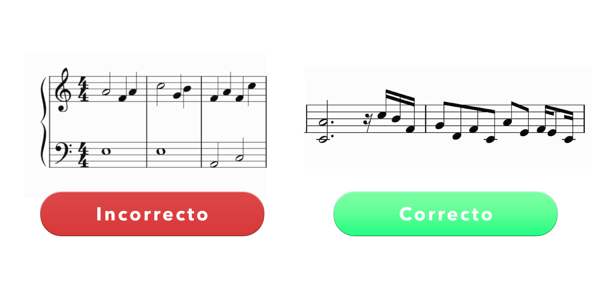

# Aclaraciones
Para empezar, recomendamos leer el siguiente [pdf](./normas_canciones_campanario.pdf) para entender cómo funciona el sistema de canciones.

## En resumen
Las figuras musicales son enumeradas de la siguiente forma:

|Nombre         | Enumeración   | Tiempo    | 
|---------------|---------------|-----------|
| Redonda       | 1             | 4         |
| Blanca        | 2             | 2         |
| Negra         | 3             | 1         |
| Corchea       | 4             | 1/2       |
| Semicorchea   | 5             | 1/4       |
| Fusa          | 6             | 1/8       |
| Semifusa      | 7             | 1/16      |

La función para reproducir una nota o silencio es la siguiente:

`play(modo, tipo, notas)`

- **modo** indica si es silencio(0, ,) o nota (1, , ) 
- **tipo** define la figura de la nota mediante su enumración (, 4, ) *es corchea*
- **notas** indica las notas que se pueden reproducir (, , C, D, E, F, G, A, B, C_) *son las ocho notas Do, Re, Mi, Fa, Sol, La, Si, Do+ en orden correspondiente y se pueden poner hasta las ocho al mismo tiempo*

Las ultimas reglas son:
- Sólo se puede tocar una sola octava musical, *las ocho notas Do, Re, Mi, Fa, Sol, La, Si, Do+.*
- No existen notas medias, como sostenidos o bemoles.

#### Un ejemplo de partitura que es funcional para agregar es el siguiente:

## Ejemplos de canciones

- [Aparitions Stalk in the night - ZUN](../canciones/song1.py) | [pdf](..canciones/aparitions-stalk-the-night-cover.pdf)
- [Seppette of the Dead Princess - ZUN](../canciones/song2.py) | [-]()
- [Wesminster Chimes - Campanario clásico](../canciones/song3.py) | [pdf](..canciones/westminsterchimes.pdf)
- [Salve Don Bosco Santo](../canciones/song4.py) | [pdf](..canciones/salvedonboscosanto.pdf)
- [We Wish You a Merry Christmas](../canciones/song5.py) | [pdf](..canciones/wewishyouamerrychrsitmas) 
- [Shanghai Alice of Meiji - ZUN](../canciones/song6.py) | [pdf](..canciones/shanghai-alice.pdf)

Estas canciones fueron transpuestas en un pasado y convertidas con las reglas

## Escribamos una partitura-script

Creemos un archivo con el nombre que queramos, pero que su formato sea `.py`, por ejemplo `never_gonna_give_you_up.py`, el nombre puede ser cualquier cosa, no importa al final, estos serán ordenados internamente para evitar choques de nombres.

> **En el siguiente código tomar el cuenta lo siguiente:**
- Todo seguido después de almenos un '#' en la línea presente es un comentario: no hace nada.
- Los comentarios indican que se debe realizar.
- Utilizar la funcion `play()` y sus parámetros.
- RESPETAR EL ESPACIO DE DIFENCIACIÓN, NO SALIRSE DE LOS ESPACIOS.

Despues de crear el archivo, podemos copiar y pegar el siguiente código, que es la plantilla para canciones.
Recordamos que tres cosas importantes que son definidas aquí:
- tempo
- título de la cancion *se mostrará en la página web*
- las notas a reprodir

En situación que quiera editarlo en un espacio diferente, puede utilizar la siguiente página para editar la canción-código.
[Editor de código: python](https://www.onlinegdb.com/online_python_compiler)
<pre><code>import time as t
from utilities.appfunctions import play, C, D, E, F, G, A, B, C_, utilidad, finalizar
import utilities.appfunctions as appfunctions

### Ingresar el tempo de la canción, recomendamos entre 50-100
appfunctions.tempo = 120

### Dentro de las comillas ingresa el título de la canción
title="Ingresa el título de la canción acá"
def appsong():
    try:
        start_time = t.time()
        utilidad()

        ### Ingresa las notas a reproducir después de este comentario
        ## Las siguientes cuatro líneas son ejemplos
        
        play(1, 3, C, G, A) # Negra con notas Do, Sol, La
        play(1, 4, D) # Corcha con nota Re
        play(0, 4) # Silencio de Corchea
        play(1, 4, G) # Corchea con nota Sol

        ### Borra las cuatro lineas anteriores cuando ya escribas tus canciones

        ### Aquí termina el espacio para escribir canciones
    except ValueError as ex:
        print(ex)

    except KeyboardInterrupt:
        print("Interrupción abrupta por teclado")

    finally:
        finalizar(t.time(), start_time)

    
if __name__ == '__main__':
    appsong()</code></pre>

Después de todo, guardemos el archivo, dirijámonos a la página web, iniciemos sesión, nos vamos en el apartado de **CONFIGURACIÓN**, cargamos el archivo en agregar canciones y lo subimos.
Después de eso, la pantalla debería cargar un mensaje, Canción 'nombre de la cancion' agregada exitosamente.

